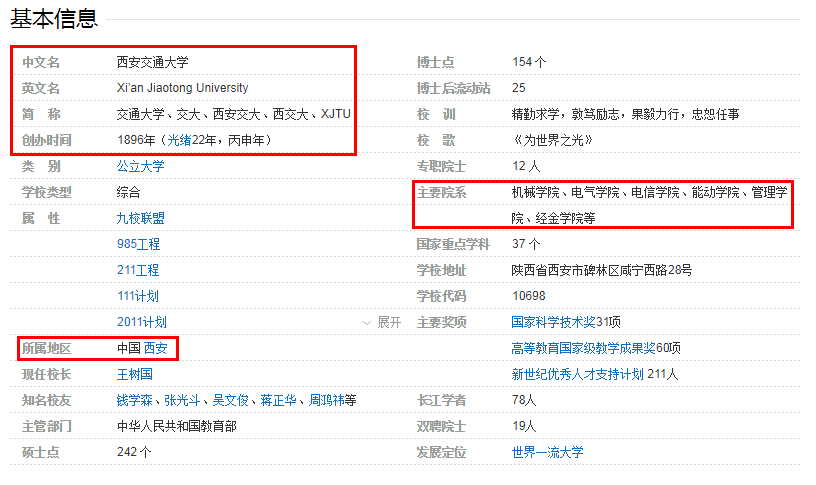
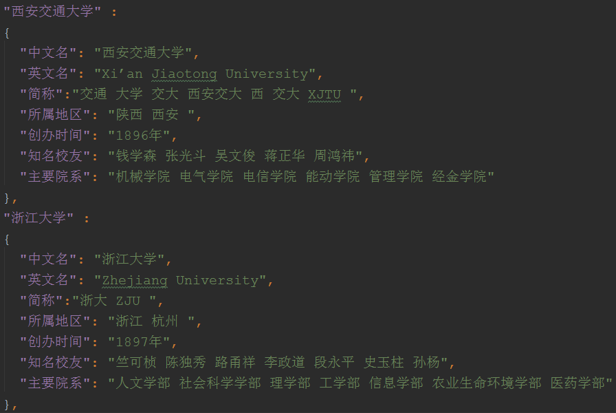

# Python 2.x 爬虫 + D3 数据可视化

抓取百度百科985高校信息

所属城市  | 中文名  | 英文名  | 创办时间  | 简称  | 知名校友  | 主要院系
--------- | --------- | --------- | --------- | --------- | --------- | ---------
city  | name  | enName  | date  | short  | friend  | dept

数据来源：

数据处理：补全信息、分词、统一格式

最后效果图：

原文作者博客：http://zhanghonglun.cn/

>我的博客，记录学习、记录生活：

>https://s-top.github.io

